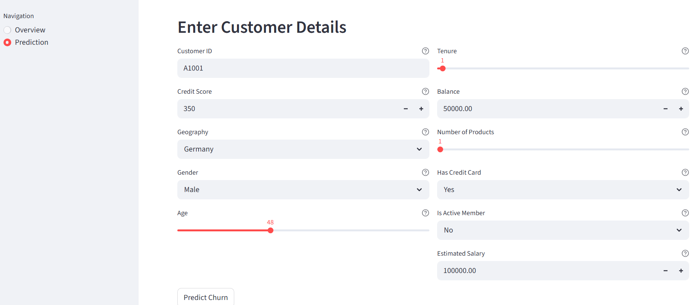
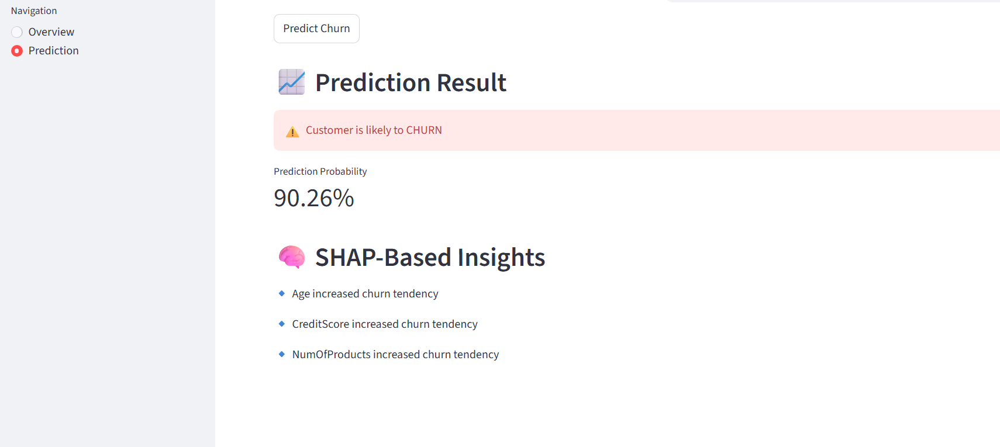
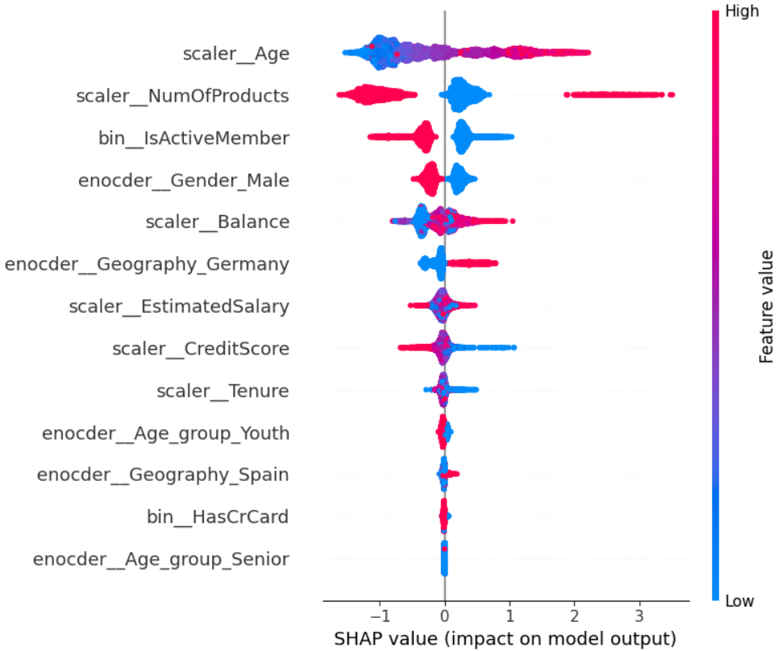
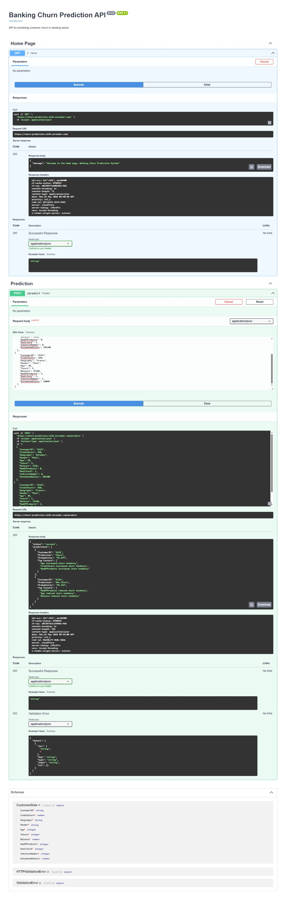

# 🏦 Banking Customer Churn Prediction System

An end-to-end Machine Learning project designed to predict customer churn in the banking sector using XGBoost, FastAPI, Streamlit, and SHAP Explainable AI.

This project simulates a production-level Machine Learning workflow covering:

- Data preprocessing
- Feature engineering
- Exploratory Data Analysis
- Model training & evaluation
- Explainable AI
- Backend API deployment
- Interactive frontend integration

The system predicts whether a customer is likely to churn and provides interpretable insights behind the prediction using SHAP values.

---

# 🚀 Live Application

## 🌐 Streamlit Frontend
https://customer-churn-prediction-ml-web.streamlit.app/

## ⚡ FastAPI Swagger Documentation
https://churn-prediction-wl34.onrender.com/docs

---

# 📌 Project Highlights

✅ End-to-End Machine Learning Pipeline  
✅ Feature Engineering & Data Preprocessing  
✅ XGBoost Model with ROC-AUC Score of **0.87**  
✅ SHAP Explainability for Model Transparency  
✅ FastAPI Backend Deployment on Render  
✅ Interactive Streamlit Frontend  
✅ Real-Time Prediction & Feature Insights  
✅ Production-Ready Modular Project Structure

---

# 🖥️ Application Preview

## 🔹 Streamlit Frontend UI



---

## 🔹 Prediction Result with SHAP Insights



---

# 📖 Project Overview

Customer churn prediction is one of the most important business problems in the banking industry. Banks often lose customers due to changing financial behavior, poor engagement, or competitive alternatives.

The primary goal of this project is to predict whether a customer is likely to churn based on banking and demographic information while also providing explainable insights behind the prediction.

This project demonstrates the complete lifecycle of a Machine Learning system including:

- Data Cleaning & Preprocessing
- Exploratory Data Analysis
- Feature Engineering
- Model Training & Evaluation
- Explainable AI using SHAP
- REST API Development
- Frontend Development
- Cloud Deployment

---

# 🎯 Business Objective

Customer retention is significantly more cost-effective than acquiring new customers.

By identifying customers with high churn probability, banks can:

- Improve retention strategies
- Reduce customer attrition
- Increase customer lifetime value
- Build targeted marketing campaigns
- Enhance customer satisfaction

---

# 📂 Dataset Information

The dataset contains customer demographic and banking-related information.

## Features Used

| Feature | Description |
|---|---|
| CreditScore | Customer credit score |
| Geography | Customer country/location |
| Gender | Customer gender |
| Age | Customer age |
| Tenure | Number of years with bank |
| Balance | Bank account balance |
| NumOfProducts | Number of banking products used |
| HasCrCard | Credit card ownership status |
| IsActiveMember | Customer activity status |
| EstimatedSalary | Estimated customer salary |

## Target Variable

| Value | Meaning |
|---|---|
| 1 | Customer Churn |
| 0 | Customer Retained |

---

# 🧠 Feature Engineering

Several feature engineering techniques were applied to improve model performance and business understanding.

## Techniques Applied

- Created engineered Age Group categories
- Applied Standard Scaling for numerical features
- Applied One-Hot Encoding for categorical variables
- Built reusable preprocessing pipelines using Scikit-learn
- Integrated preprocessing and inference into a single pipeline

---

# 📊 Exploratory Data Analysis

EDA was performed to identify churn behavior patterns and important business insights.

## Key Insights Identified

- Older customers showed higher churn tendency
- Inactive customers had significantly higher churn probability
- Customers with fewer banking products were more likely to churn
- Geography had strong influence on customer retention
- High balance customers showed varying churn patterns

---

# 📊 Model Evaluation & Final Model Selection

Multiple Machine Learning models were evaluated to identify the most reliable model for customer churn prediction.

Since this is an imbalanced classification problem, the primary focus was placed on:

- Recall for Class 1 (Churn Customers)
- ROC-AUC Score
- Ability to correctly identify churn customers
- Overall balance between precision and recall

In churn prediction problems, failing to identify a churn customer is more costly than incorrectly classifying a retained customer as churn.

Therefore, special attention was given to the performance of **Class 1 (Churn)** predictions.

---

# 🔹 Baseline Model — Logistic Regression

| Metric | Value |
|---|---|
| Accuracy | 83% |
| ROC-AUC Score | 0.79 |
| Recall for Churn Class (1) | 0.28 |
| Precision for Churn Class (1) | 0.70 |

## Insights

The Logistic Regression model achieved good overall accuracy and precision but struggled to identify churn customers effectively.

Although the model correctly classified retained customers very well, it failed to capture most churn customers, resulting in a very low recall of **28%** for Class 1.

This indicates that the model was biased toward the majority class and unsuitable for a churn prediction business problem where identifying churn customers is critical.

---

# 🔹 Decision Tree Classifier

| Metric | Value |
|---|---|
| Accuracy | 77% |
| ROC-AUC Score | 0.66 |
| Recall for Churn Class (1) | 0.47 |
| Precision for Churn Class (1) | 0.45 |

## Insights

The Decision Tree model improved churn detection compared to Logistic Regression but produced unstable and less generalized predictions.

The model showed weaker ROC-AUC performance and lower precision, indicating poor separation capability between churn and non-churn customers.

Although recall improved slightly, overall performance remained insufficient for reliable business deployment.

---

# 🔹 Random Forest Classifier

| Metric | Value |
|---|---|
| Accuracy | 76% |
| ROC-AUC Score | 0.86 |
| Recall for Churn Class (1) | 0.77 |
| Precision for Churn Class (1) | 0.44 |

## Insights

Random Forest significantly improved churn detection performance and achieved a strong ROC-AUC score of **0.86**.

The model achieved a high recall of **77%** for churn customers, meaning it successfully identified most customers likely to leave the bank.

However, the precision for churn predictions remained relatively low, indicating an increased number of false positive predictions.

Despite this limitation, the model demonstrated strong capability in handling the imbalance problem and capturing churn patterns effectively.

---

# 🔹 Final Model — XGBoost Classifier

| Metric | Value |
|---|---|
| Accuracy | 81% |
| ROC-AUC Score | 0.87 |
| Recall for Churn Class (1) | 0.76 |
| Precision for Churn Class (1) | 0.52 |
| F1-Score for Churn Class (1) | 0.62 |

## Insights

The XGBoost model achieved the best overall balance between churn detection and prediction reliability.

The model produced:

- Highest ROC-AUC Score (**0.87**)
- Strong churn recall (**76%**)
- Better precision than Random Forest
- Improved class separation capability
- Better generalization performance

Unlike Logistic Regression, XGBoost successfully captured complex non-linear relationships between customer behavior and churn probability.

Compared to Random Forest, XGBoost maintained strong churn detection while reducing false positive predictions through improved precision.

---

# ✅ Why XGBoost Was Selected as Final Model

XGBoost was selected as the final production model because it provided the best trade-off between:

- Churn customer identification
- Prediction reliability
- Overall model stability
- Generalization capability
- ROC-AUC performance

The model demonstrated strong ability to identify customers likely to churn while maintaining balanced performance across both classes.

Its superior ROC-AUC score and improved Class 1 metrics made it the most suitable model for real-world churn prediction deployment.

---

# 🔍 Explainable AI using SHAP

SHAP (SHapley Additive exPlanations) was integrated to improve model transparency and interpretability.

The SHAP analysis helps explain:

- Which features increase churn probability
- Which features reduce churn probability
- Global feature importance
- Individual customer prediction insights

---

# 📈 SHAP Summary Plot



## Important Observations from SHAP

- Higher age positively influenced churn probability
- Active membership reduced churn tendency
- Number of products strongly influenced predictions
- Geography and balance contributed significantly to customer behavior

---

# ⚙️ System Architecture

```text
Streamlit Frontend
        ↓
FastAPI Backend
        ↓
ML Preprocessing Pipeline
        ↓
XGBoost Prediction Engine
        ↓
SHAP Explainability Module
```

---

# 🧩 Tech Stack

## 🔹 Programming & ML Libraries

- Python
- Pandas
- NumPy
- Scikit-learn
- XGBoost
- SHAP

## 🔹 Backend

- FastAPI
- Uvicorn

## 🔹 Frontend

- Streamlit

## 🔹 Deployment & Tools

- Render
- Streamlit Cloud
- GitHub

---

# 🌐 API Endpoints

## Home Endpoint

```http
GET /
```

---

## Prediction Endpoint

```http
POST /predict
```

---

# 📘 Swagger API Documentation



---

# 🏗️ Project Structure

```text
CHURN_PREDICTION/
│
├── Backend/
│   ├── __init__.py
│   ├── feature_engineering.py
│   ├── main.py
│   ├── model_inference.py
│   ├── requirements_backend.txt
│   ├── schema.py
│   ├── XGB_model.pkl
│
├── Frontend/
│   ├── streamlit_ui.py
│   ├── requirements.txt
│
├── Notebook/
│   ├── churn_pred.ipynb
│
├── Dataset/
│   ├── Churn_Modelling.csv
│
├── images/
│   ├── ui_demo.png
│   ├── ui_prediction-result.png
│   ├── shap_summaryplot.png
│   ├── swagger_api.jpeg
│
├── README.md
├── .gitignore
```

---

# 🚀 Deployment

## Backend Deployment
- FastAPI backend deployed using Render

## Frontend Deployment
- Streamlit application deployed using Streamlit Cloud

---

# 🔮 Future Improvements

- Docker Containerization
- Batch Prediction Support
- Database Integration
- CI/CD Pipeline Integration
- User Authentication System
- Monitoring & Logging Integration

---

# 👨‍💻 Author

## Kushal K N

Aspiring Data Scientist with strong interest in:

- Machine Learning
- Model Deployment
- Explainable AI
- Data Analytics
- End-to-End ML Systems

### GitHub
https://github.com/Kushal-kush1
